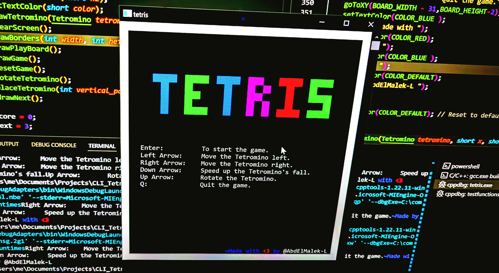

# 🎮 CLI Tetris clone  🚀  
  
*A nostalgic console-based Tetris adventure with a retro twist!*
*as **Cheb Alärbi** always says: `wah alyyam wah`.*  


---

## 🕹️ **What is this?**  
Relive the golden era of gaming with this terminal-based Tetris clone! Built in C, it’s packed with colorful blocks, smooth controls, and that classic *"just one more round"* vibe. Perfect for quick breaks or coding inspiration!  

---

## ✨ **Features**  
- 🟦 **7 Classic Tetromino Shapes**: I, T, S, Z, L, J, O — all here!  
- 🎨 **Vibrant Colors**: Blocks pop in magenta, green, blue, red, and yellow.  
- 🔄 **Rotate & Move**: Spin blocks with a tap, slide them left/right.  
- 🔮 **Next Piece Preview**: Plan your strategy like a pro!  
- 📊 **Score Tracking**: How high can you climb?  
- 🖌️ **Retro Console Art**: ASCII borders and a snazzy Tetris logo.  

---

## 🕹️ **Controls**  
- **ENTER**: Start/Pause Game  
- **← → Arrows**: Move Left/Right  
- **↑ Arrow**: Rotate Block  
- **Q**: Quit Game  

---

## 🛠️ **Installation**  
1. **Clone the repo**:  
   ```bash  
   git clone https://github.com/AbdElMalek-L/TETRIS_CLONE.git  
   ```  
2. **Compile** (Windows only — needs `windows.h`):  
   ```bash  
   gcc tetris.c -o tetris.exe  
   ```  
3. **Play!**  
   ```bash  
   ./tetris.exe  
   ```  

---

## 🎯 **How to Play**  
1. **Stack ‘em up**: Fit blocks to clear lines.  
2. **Speed up**: Blocks fall faster as you level up.  
3. **Survive**: Don’t let blocks reach the top!  

*Pro Tip: Master the S and Z spins for epic combos!*  

---

## 🎉 **Ready to Play?**  
Dive into the terminal, fire up the game, and chase that high score! Whether you’re here for the coding magic or the classic Tetris fun — **let’s get stacking!**  

---

## 🙏 **Credits**  
Crafted with ❤️ by **AbdElMalek-L**.  
*"For the love of pixels and infinite loops!"*  


---

**License**: Free to play, tweak, and share! (Credit the creator 💖)